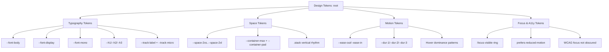
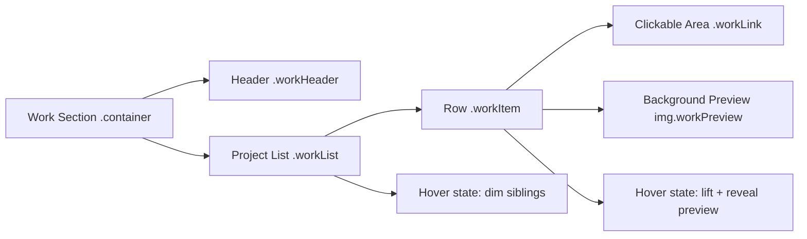

# Portfolio Typography, Spacing, and Interaction System Alignment Study

## Executive summary

Your goal (“closer in energy to Jackie’s, but still original and controlled”) is achievable with **CSS-level shifts** that increase *contrast in hierarchy* and *contrast in interaction states*—without copying layout motifs 1:1.

The highest-signal differences, based on the sources we can verify:

Jackie’s portfolio feels “alive” because it combines **a distinctive type voice + unconventional micro-typography + interaction dominance**:
- **Type pairing is intentionally characterful**: sources that catalogue the site identify a mono + display pairing (IBM Plex Mono + Historia Sky). citeturn19search0  
- The page copy itself shows **spaced/expanded letterforms for identity labels** (“P r o d u c t D e s i g n”, “V e r b & N o u n”), which signals deliberate tracking/letter-spacing and “label-like” typography. citeturn2view1  
- The “messy desktop” intro and hover behaviour strongly emphasize **play + control**: the intro is described as rearrangeable, with sound effects on hover; the work section uses hover to reveal arranged visuals. citeturn11search18  

Your site (leanale.com) + your simulation section (per your description) currently have a solid foundation (tokens / motion), but your complaint (“boring sterile”) usually happens when:
- headings are not “typed” as a system (weak scale, weak contrast),
- spacing is consistent but *flat* (same rhythm everywhere),
- hover states are present but **not dominant** (no de-emphasis of non-active items),
- metadata styles don’t add “editorial UI” character (everything feels equally important).

So the strategy is:
1) Add a **more opinionated typographic system** (body vs display vs mono) using fluid sizing and label styles (tracking, case, subtle opacity). (MDN’s `clamp()` is ideal for fluid sizing.) citeturn15search0  
2) Add a **space system that “breathes”** (fluid space palette) so large-screen layouts feel expansive without breakpoints. (Utopia provides a proven pattern for fluid type + space tokens.) citeturn26search0turn26search1  
3) Add **interaction dominance** to projects: non-hovered items soften; hovered item gains contrast + preview emphasis (mirrors the “hover reveals visuals” pattern described for Jackie). citeturn11search18  
4) Keep accessibility strong with real focus states (`:focus-visible`) and reduced-motion support. citeturn15search4turn15search5turn25search1turn25search7  

## Comparative findings across typography, spacing, and interactions

### Typography voice and hierarchy

**Jackie (verified signals)**
- Uses a **mono + display** pairing (IBM Plex Mono + Historia Sky) and is built on Framer. citeturn19search0  
- Uses **wide-tracked labels** and “UI-ish editorial typography” (visible in the rendered text such as “P r o d u c t D e s i g n”). citeturn2view1  
- Interaction and personality are integrated into the typography system: playful microcopy + strong label treatment + clear “work list” semantics. citeturn11search18  

**What to translate (without copying)**
- Don’t imitate Jackie’s exact fonts/layout; instead copy the *principles*:  
  - **Mono for metadata/control surfaces** (eyebrows, nav labels, timestamps, tags). IBM describes Plex as a versatile family with multiple subfamilies and weights; Plex Mono exists as part of the family. citeturn19search1turn19search9  
  - **A display face for high-attention moments** (hero title, case study titles).  
  - **Letter-spacing as a “UI affordance”** for small labels (the “spaced letters” cue). citeturn2view1  

### Spacing, layout rhythm, grid

**Feather + modern marketing references (signals)**
- Feather is documented as a minimal marketing site and its showcased palette includes **#333333 and #AAAAAA**, implying restrained contrast and quiet surfaces. citeturn20view0  
- It’s tagged with animation/transitions/gestures and includes React + GSAP in the showcase metadata—strong signal that motion is part of perceived quality. citeturn20view0  

**What to translate**
- Use a **fluid space palette** so spacing relaxes on large screens while staying tight and readable on mobile (Utopia approach). citeturn26search0turn26search1  
- Build layout primitives (container, stack, grid) so pages don’t feel like uniform vertical dumps; use compositional rhythm rather than identical section padding everywhere (Every Layout’s “Stack” pattern is a canonical primitive for vertical rhythm). citeturn26search4  

### Interactions and state dominance

**Jackie (verified interaction signals)**
- The site is explicitly described as having an interactive “desktop” intro and a work section where visuals appear on hover. citeturn11search18  

**Translation you want**
- **Hover dominance**: hovered project becomes the “active object,” others step back.
- **Preview as reward**: hovering should reveal something meaningful (image/thumbnail, meta, excerpt).
- **Motion as reinforcement**: not “animation for animation’s sake,” but quick easing and small transforms.

### Accessibility and motion preferences

To keep “heavy Jackie inspo” from becoming fragile:
- Use `:focus-visible` so keyboard users always see focus without forcing focus rings for mouse users. citeturn15search4  
- Respect `prefers-reduced-motion` to reduce non-essential animation. citeturn15search5  
- Keep focus indicators visible and avoid styling that removes them; WCAG guidance emphasizes visible focus. citeturn25search1turn25search0  
- WCAG 2.2 adds focus visibility-related considerations like “Focus Not Obscured” (AA). citeturn25search7turn25search5  

## Prioritized CSS changes to shift “sterile” → “designed + alive”

These are ordered by **impact per line of CSS**.

### Unify a three-voice type system

1) **Adopt 3 font roles**:
- `--font-body`: neutral sans (keep your current if you like it)
- `--font-mono`: IBM Plex Mono for metadata + nav labels + tags  
- `--font-display`: a display serif/sans for hero + case study titles (original choice; don’t copy Historia Sky)

Jackie’s font pairing is explicitly catalogued as a mono + display combination. citeturn19search0

2) **Create a real type scale** with `clamp()` so it grows smoothly across viewports. (MDN documents `clamp()` and explicitly calls out font-size usage.) citeturn15search0  

3) **Introduce “label typography”**:
- uppercase or small-caps feel,
- wider letter-spacing,
- slightly reduced opacity,
- mono font.

This mirrors the “spaced label” feel visible on Jackie’s page. citeturn2view1  

### Replace static spacing with a fluid space palette

4) **Implement fluid space tokens** (S/M/L/XL…) inspired by Utopia’s “fluid space palette” approach. citeturn26search1turn26search3  

5) **Add layout primitives**:
- `.container` with consistent padding + max width
- `.stack` for vertical rhythm (Every Layout’s Stack is a known approach). citeturn26search4  
- `.grid-12` for projects/case study sections.

### Make interactions dominant, not decorative

6) **Project list: dim non-hover items** on parent hover; emphasize hovered row (opacity/blur optional). This is the closest “translation” of the described behaviour (“visuals appearing when you hover project links”). citeturn11search18  

7) **Give hover states an authored feel**:
- use one easing curve,
- small translate + shadow + border contrast,
- consistent durations.

8) **Links become objects**:
- underlines are styled (thickness + offset),
- hover changes underline and text colour subtly,
- focus-visible has a designed ring.

### Accessibility: keep it strong while adding energy

9) **Add robust `:focus-visible` styles** (MDN guidance + WCAG focus visible intent). citeturn15search4turn25search1  

10) **Add `prefers-reduced-motion` overrides** for transitions and transforms. citeturn15search5  

## Ready-to-drop CSS and minimal JSX adjustments

Below is a “drop-in” package you can paste into your global stylesheet (e.g., `global.css`) **after your existing tokens** so it overrides defaults cleanly.

### Global tokens, typography, spacing, and interaction foundation

```css
/* =========================================================
   PORTFOLIO ENERGY LAYER
   Goal: closer to Jackie-like energy (editorial + interactive)
   without copying layouts. Add AFTER existing tokens.
   ========================================================= */

/* ---------- Typography Roles ---------- */
:root {
  /* Keep your current body font if you already love it */
  --font-body: system-ui, -apple-system, Segoe UI, Roboto, Helvetica, Arial, sans-serif;

  /* Jackie-inspired principle: mono for UI labels + metadata
     (Jackie uses IBM Plex Mono per sources) */
  --font-mono: "IBM Plex Mono", ui-monospace, SFMono-Regular, Menlo, Monaco, Consolas, "Liberation Mono", monospace;

  /* Choose YOUR OWN display font (do not copy Historia Sky).
     Good directions: high-contrast serif OR a quirky humanist sans.
     Replace "Instrument Serif" with your chosen font if you load one. */
  --font-display: "Instrument Serif", ui-serif, Georgia, serif;

  /* ---------- Fluid Type Scale (clamp-based) ---------- */
  /* Body */
  --text-sm: clamp(0.90rem, 0.25vw + 0.85rem, 1.00rem);
  --text-md: clamp(1.00rem, 0.35vw + 0.92rem, 1.10rem);
  --text-lg: clamp(1.15rem, 0.60vw + 1.00rem, 1.35rem);

  /* Headings */
  --h3: clamp(1.35rem, 1.10vw + 1.05rem, 1.75rem);
  --h2: clamp(1.75rem, 2.00vw + 1.20rem, 2.50rem);
  --h1: clamp(2.25rem, 3.20vw + 1.40rem, 3.50rem);

  /* ---------- Line-height + tracking ---------- */
  --lh-tight: 1.10;
  --lh-snug: 1.25;
  --lh-body: 1.55;

  --track-tight: -0.015em;
  --track-normal: 0;
  --track-label: 0.22em; /* “P r o d u c t D e s i g n” energy */
  --track-micro: 0.12em;

  /* ---------- Fluid Space Palette (Utopia-inspired shape) ---------- */
  /* Small/large endpoints baked into clamp for "breathing" layouts */
  --space-2xs: clamp(0.25rem, 0.15vw + 0.22rem, 0.35rem);
  --space-xs:  clamp(0.50rem, 0.30vw + 0.42rem, 0.70rem);
  --space-s:   clamp(0.75rem, 0.55vw + 0.62rem, 1.05rem);
  --space-m:   clamp(1.00rem, 0.85vw + 0.75rem, 1.50rem);
  --space-l:   clamp(1.50rem, 1.40vw + 1.05rem, 2.25rem);
  --space-xl:  clamp(2.00rem, 2.20vw + 1.25rem, 3.25rem);
  --space-2xl: clamp(3.00rem, 3.60vw + 1.60rem, 5.00rem);

  /* ---------- Containers ---------- */
  --container-max: 72rem;          /* ~1152px */
  --container-pad: clamp(1rem, 3.5vw, 2.5rem);

  /* ---------- Interaction tokens ---------- */
  --ease-out: cubic-bezier(0.16, 1, 0.3, 1);
  --ease-in: cubic-bezier(0.7, 0, 0.84, 0);

  --dur-1: 120ms;
  --dur-2: 220ms;
  --dur-3: 360ms;

  /* ---------- Focus ---------- */
  --focus-ring: 2px;
  --focus-offset: 3px;
}

/* ---------- Base text rendering ---------- */
html {
  text-size-adjust: 100%;
}

body {
  font-family: var(--font-body);
  font-size: var(--text-md);
  line-height: var(--lh-body);
  letter-spacing: var(--track-normal);
}

/* Headings feel “typed”, not default */
h1, h2, h3 {
  letter-spacing: var(--track-tight);
  line-height: var(--lh-tight);
}

h1 { font-family: var(--font-display); font-size: var(--h1); }
h2 { font-family: var(--font-display); font-size: var(--h2); line-height: var(--lh-snug); }
h3 { font-family: var(--font-body);    font-size: var(--h3); line-height: var(--lh-snug); }

/* ---------- Layout primitives ---------- */
.container {
  width: 100%;
  max-width: var(--container-max);
  margin-inline: auto;
  padding-inline: var(--container-pad);
}

.stack > * + * {
  margin-top: var(--space-m);
}

.stack-tight > * + * {
  margin-top: var(--space-s);
}

/* Editorial reading width (case studies, about) */
.prose {
  max-width: 68ch;
}

/* ---------- Metadata / label typography (Jackie-like energy) ---------- */
.meta,
.kicker,
.eyebrow {
  font-family: var(--font-mono);
  font-size: var(--text-sm);
  letter-spacing: var(--track-label);
  text-transform: uppercase;
  line-height: var(--lh-snug);
  opacity: 0.78;
}

/* A tighter label for tags/buttons where wide tracking is too much */
.micro {
  font-family: var(--font-mono);
  font-size: 0.80em;
  letter-spacing: var(--track-micro);
  text-transform: uppercase;
  opacity: 0.80;
}

/* ---------- Links as designed objects ---------- */
a {
  text-decoration-thickness: 1px;
  text-underline-offset: 0.18em;
  transition: opacity var(--dur-2) var(--ease-out),
              text-decoration-thickness var(--dur-2) var(--ease-out),
              transform var(--dur-2) var(--ease-out);
}

a:hover {
  text-decoration-thickness: 2px;
}

/* ---------- Buttons (minimal, editorial) ---------- */
.btn {
  display: inline-flex;
  align-items: center;
  gap: 0.55em;
  padding: calc(var(--space-xs) + 0.10rem) var(--space-s);
  border-radius: 999px; /* pill: “object” feel */
  font-family: var(--font-mono);
  letter-spacing: var(--track-micro);
  text-transform: uppercase;
  font-size: var(--text-sm);
  line-height: 1;
  transition: transform var(--dur-2) var(--ease-out),
              box-shadow var(--dur-2) var(--ease-out),
              opacity var(--dur-2) var(--ease-out);
}

.btn:hover {
  transform: translateY(-2px);
}

/* ---------- Focus visibility (keyboard-first) ---------- */
:where(a, button, input, textarea, select, [tabindex]):focus-visible {
  outline: var(--focus-ring) solid currentColor;
  outline-offset: var(--focus-offset);
}

/* ---------- Reduced motion ---------- */
@media (prefers-reduced-motion: reduce) {
  * {
    animation-duration: 0.001ms !important;
    animation-iteration-count: 1 !important;
    transition-duration: 0.001ms !important;
    scroll-behavior: auto !important;
  }
}
```

### “Jackie energy” project list pattern (hover dominance + preview reveal)

This is the single most effective shift for “boring/sterile project display.”

**Minimal JSX structure** (adapt to your current components; class names are the key):

```jsx
<section className="container work">
  <div className="workHeader stack-tight">
    <div className="eyebrow">Selected Work</div>
    <h2>Projects</h2>
  </div>

  <ul className="workList" role="list">
    <li className="workItem">
      <a className="workLink" href="/projects/inklink">
        <span className="meta">2025 • Product Design</span>
        <span className="workTitle">InkLink</span>
      </a>
      
    </li>

    {/* repeat */}
  </ul>
</section>
```

**CSS**:

```css
/* Work section: hover dominance + “visual reward” preview */

.work {
  padding-block: var(--space-xl);
}

.workHeader {
  margin-bottom: var(--space-l);
}

/* List as an experience */
.workList {
  display: grid;
  gap: var(--space-s);
  padding: 0;
  margin: 0;
  list-style: none;
}

/* Each item becomes an “interactive row” */
.workItem {
  position: relative;
  border-radius: 16px;
  overflow: clip;
}

/* The link is the main hit target */
.workLink {
  display: grid;
  gap: 0.40rem;
  padding: var(--space-m);
  text-decoration: none;
  will-change: transform;
  transition: transform var(--dur-2) var(--ease-out),
              opacity var(--dur-2) var(--ease-out);
}

.workTitle {
  font-size: var(--text-lg);
  letter-spacing: var(--track-tight);
  line-height: var(--lh-snug);
}

/* Preview sits behind, revealed on hover.
   This gives “Jackie hover reveals visuals” energy without JS. */
.workPreview {
  position: absolute;
  inset: 0;
  width: 100%;
  height: 100%;
  object-fit: cover;

  opacity: 0;
  transform: scale(1.03);
  transition: opacity var(--dur-3) var(--ease-out),
              transform var(--dur-3) var(--ease-out);
  pointer-events: none;
}

/* Hover dominance:
   When the list is hovered, all items soften… */
.workList:hover .workLink {
  opacity: 0.38;
}

/* …except the hovered item, which becomes “the object” */
.workItem:hover .workLink {
  opacity: 1;
  transform: translateY(-2px);
}

/* Preview reveals only for hovered item */
.workItem:hover .workPreview {
  opacity: 0.18; /* keep readable — controlled, not chaotic */
  transform: scale(1);
}

/* Mobile: keep it clean and readable */
@media (max-width: 48rem) {
  .workList:hover .workLink {
    opacity: 1; /* don’t punish touch users */
  }
  .workPreview {
    display: none;
  }
}
```

Why this maps tightly to your “heavy Jackie inspo” request: it reproduces the **interaction principle** described in write-ups (hovering project links reveals visuals), without copying her exact layout. citeturn11search18  

### Case study baseline (editorial rhythm without “blog template”)

```css
.caseStudy {
  padding-block: var(--space-2xl);
}

.caseStudyHeader {
  margin-bottom: var(--space-xl);
}

.caseStudyHeader .meta {
  margin-bottom: var(--space-xs);
}

.caseStudyContent {
  max-width: 72ch;
}

.caseStudySection {
  padding-block: var(--space-l);
}

.caseStudySection > * + * {
  margin-top: var(--space-s);
}

/* A restrained “decision/outcome” block that isn’t a heavy card */
.callout {
  padding: var(--space-m);
  border-radius: 18px;
  backdrop-filter: blur(6px); /* optional; remove if you dislike */
}

.calloutTitle {
  font-family: var(--font-mono);
  letter-spacing: var(--track-micro);
  text-transform: uppercase;
  font-size: var(--text-sm);
  margin-bottom: var(--space-xs);
  opacity: 0.85;
}
```

## Implementation plan and testing checklist

### Implementation plan

1) **Add the “energy layer” CSS** after your current tokens so it overrides safely (type scale, label styles, container/stack, focus, reduced motion). The `clamp()` approach is standards-based and widely supported. citeturn15search0  
2) **Apply the `.meta/.eyebrow/.micro` classes** on: nav labels, project metadata, dates, tags. This is the fastest visible shift toward Jackie-like editorial UI signals. citeturn2view1turn19search0  
3) **Refactor the work/project list** to the hover-dominance pattern (CSS above). This is the biggest “sterile → alive” jump and aligns with the documented hover-reveal behaviour. citeturn11search18  
4) **Case studies**: wrap long-form content in `.prose` and apply `caseStudy*` classes for spacing rhythm.  
5) **Optional**: adopt a fluid space palette more comprehensively (Utopia-style) once the basics land; it scales your “editorial breathing” across breakpoints without managing breakpoints manually. citeturn26search0turn26search1  

### Testing checklist

Keyboard + focus
- Tab through nav, project list, buttons, links: focus ring always visible (`:focus-visible`). citeturn15search4turn25search1  
- Ensure focus is not hidden behind sticky headers; WCAG 2.2 includes “Focus Not Obscured (Minimum)” at AA. citeturn25search5turn25search7  

Motion
- Enable “Reduce motion” at OS level: transitions and transforms should effectively stop. citeturn15search5  

Responsive
- Mobile: no “dim others on hover” behaviour (touch users), previews hidden or moved to inline.  
- Desktop: project list hover dominance works and text stays readable.

Contrast
- Check contrast for body text and any muted metadata; don’t let “aesthetic muted” harm readability (especially if you reduce opacity on metadata).

## Visual references and token/layout diagrams

image_group{"layout":"carousel","aspect_ratio":"16:9","query":["jackiehu.design portfolio homepage screenshot","Jackie Hu messy desktop portfolio interaction screenshot","feather.computer website screenshot","getjust.eu website screenshot"],"num_per_query":1}

### Token relationships map



### Layout relationship sketch for the work section



If you want this to feel *even closer* to Jackie’s energy (while staying original), the next increment beyond CSS is **cursor-aware preview positioning** (preview follows mouse within bounds) and optional micro-sound. Those require a small amount of JS/Framer Motion, but the CSS foundation above sets you up so those enhancements don’t feel gimmicky—they feel authored.